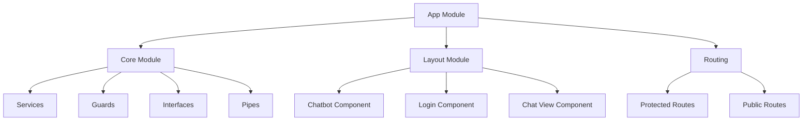
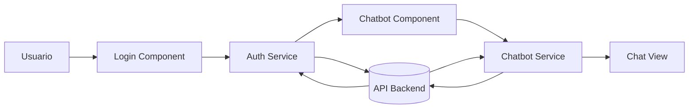

# ChatbotAI-Project-ValleGrancito 🤖💬


<p align="center">
  
  
</p>

Una aplicación de chatbot inteligente construida con **Angular 17**, diseñada para ser completamente responsiva y adaptarse a cualquier dispositivo. Este proyecto demuestra el uso avanzado de tecnologías modernas para crear interfaces de usuario dinámicas y atractivas.

## 🌟 Características Principales

### 💬 Chat Inteligente
- **Interfaz de chat intuitiva** con respuestas en tiempo real
- **Historial de conversaciones** persistente
- **Gestión múltiple de chats** simultáneos

### 🔐 Sistema de Autenticación
- **Registro y login seguro** de usuarios
- **Protección de rutas** con guards
- **Gestión de sesiones** robusta

### 👤 Perfil de Usuario
- **Personalización completa** del perfil
- **Avatares personalizables**
- **Edición de información** en tiempo real

### 🎨 Interfaz Moderna
- **Diseño inspirado en ChatGPT** con tema oscuro
- **Experiencia de usuario fluida** y responsive
- **Animaciones y transiciones** suaves

## 🛠️ Tecnologías Utilizadas

| Tecnología | Versión | Propósito |
|------------|---------|-----------|
| **Angular** | 17.x | Framework principal |
| **TypeScript** | 5.x | Lenguaje de programación |
| **Tailwind CSS** | 3.x | Framework de estilos |
| **Node.js** | 18.x | Entorno de ejecución |
| **npm** | 9.x | Gestor de paquetes |

### Librerías y Herramientas Adicionales
- **Material Symbols** - Iconografía moderna
- **Bootstrap Icons** - Conjunto adicional de iconos
- **SweetAlert2** - Notificaciones y alertas elegantes
- **RxJS** - Programación reactiva
- **Jasmine/Karma** - Testing unitario

## 📁 Arquitectura y Estructura del Proyecto

### Diagrama de Arquitectura



### Estructura Detallada de Carpetas

```
src/
├── app/
│   ├── core/                    # Módulo central con servicios compartidos
│   │   ├── guards/              # Guards de autenticación y seguridad
│   │   │   └── auth.guard.ts    # Protección de rutas
│   │   ├── interface/           # Interfaces TypeScript
│   │   │   ├── chat.ts          # Interface para chats
│   │   │   └── message.ts       # Interface para mensajes
│   │   ├── pipe/                # Pipes personalizados
│   │   │   └── nl2br.pipe.ts    # Conversión de saltos de línea
│   │   └── service/             # Servicios centrales
│   │       ├── auth.service.ts  # Autenticación de usuarios
│   │       └── chatbot.service.ts # Lógica del chatbot
│   │
│   ├── layout/                  # Componentes principales de la UI
│   │   ├── chat-view/           # Vista detallada de chat
│   │   ├── chatbot/             # Componente principal del chatbot
│   │   └── login/               # Componente de autenticación
│   │
│   ├── app.config.ts            # Configuración de la aplicación
│   ├── app.routes.ts            # Definición de rutas
│   └── app.component.ts         # Componente raíz
│
├── assets/                      # Recursos estáticos
├── environments/                # Configuraciones por entorno
└── styles.css                   # Estilos globales
```

### Diagrama de Flujo de Datos



## 🎨 Diseño Responsivo

### Funcionalidades Responsive
- **Mobile First** - Optimizado para dispositivos móviles
- **Sidebar Adaptativo** - Menú lateral con toggle
- **Grid Responsivo** - Tarjetas que se ajustan automáticamente
- **Tipografía Escalable** - Textos adaptables a diferentes pantallas
- **Botones Táctiles** - Tamaños óptimos para interacción móvil

### Breakpoints Implementados
- **Móvil**: < 640px (sm)
- **Tablet**: 640px - 1024px (md, lg)
- **Desktop**: > 1024px (xl, 2xl)

## 🚀 Instalación y Ejecución

### Requisitos Previos
- Node.js >= 18.x
- npm >= 9.x

### Pasos de Instalación

1. **Clonar el repositorio**
```bash
git clone https://github.com/vallegrancito/ChatbotAI-Project-ValleGrancito.git
cd ChatbotAI-Project-ValleGrancito
```

2. **Instalar dependencias**
```bash
npm install
```

3. **Ejecutar en modo desarrollo**
```bash
npm start
# o
ng serve
```

4. **Construir para producción**
```bash
npm run build
# o
ng build --prod
```

5. **Abrir en el navegador**
```
http://localhost:4200
```

## 🧪 Testing

### Ejecutar Tests Unitarios
```bash
npm test
# o
ng test
```

### Ejecutar Tests End-to-End
```bash
npm run e2e
# o
ng e2e
```

## 📦 Dependencias Principales

```json
{
  "@angular/core": "^17.0.0",
  "@angular/common": "^17.0.0",
  "@angular/forms": "^17.0.0",
  "@angular/router": "^17.0.0",
  "rxjs": "~7.8.0",
  "tailwindcss": "^3.0.0",
  "sweetalert2": "^11.0.0"
}
```

## 🎯 Optimizaciones

### Performance
- **Lazy Loading** de módulos
- **OnPush Change Detection** para mejor rendimiento
- **Optimización de imágenes** y recursos
- **Tree Shaking** para reducir tamaño del bundle

### Accesibilidad
- **Etiquetas ARIA** apropiadas
- **Navegación por teclado** completa
- **Contraste de colores** WCAG 2.1 AA
- **Soporte para lectores de pantalla**

## 📱 Capturas de Pantalla

<p align="center">
  
  
</p>

## 🤝 Contribución

1. Fork el proyecto
2. Crea una rama para tu feature (`git checkout -b feature/AmazingFeature`)
3. Commit tus cambios (`git commit -m 'Add some AmazingFeature'`)
4. Push a la rama (`git push origin feature/AmazingFeature`)
5. Abre un Pull Request

## 📄 Licencia

Este proyecto está bajo la Licencia MIT - ver el archivo [LICENSE](LICENSE) para detalles.

## 👥 Autor

**Johan T. Malasquez** - *Desarrollador Full Stack*
**Maria F. Lazaro** - *Desarrolladora Full Stack*

---

<p align="center">
## 🙏 Agradecimientos

- **Angular Team** por el framework excepcional
- **Tailwind Labs** por el increíble framework CSS
- **Google** por Material Design Icons
- **Comunidad Open Source** por las innumerables librerías y herramientas
</p>
